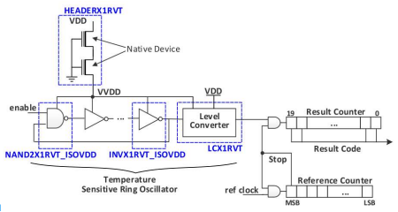
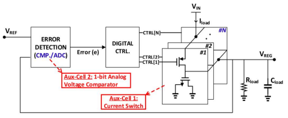

# OpenFASoC: Fully Open-Source Autonomous SoC Synthesis using Customizable Cell-Based Synthesizable Analog Circuits

The FASoC Program is focused on developing a complete system-on-chip (SoC) synthesis tool from user specification to GDSII with fully open-sourced tools.

See more on our [website](https://fasoc.engin.umich.edu/).

# Prerequisites

Please build the following tools:

  Magic <https://github.com/RTimothyEdwards/magic>

  Netgen <https://github.com/RTimothyEdwards/netgen>

  Klayout <https://github.com/KLayout/klayout>
        Please use this command to build preferably: `./build.sh -option '-j8' -noruby -without-qt-multimedia -without-qt-xml -without-qt-svg`


  Yosys <https://github.com/The-OpenROAD-Project/yosys>

  OpenROAD <https://github.com/The-OpenROAD-Project/OpenROAD> (commid id: 7ff7171)

  open_pdks <https://github.com/RTimothyEdwards/open_pdks>

   - open_pdks is required to run drc/lvs check and the simulations
   - After open_pdks is installed, please update the **open_pdks** key in `common/platform_config.json` with the installed path, down to the sky130A folder

  Other notice:

   - Python 3.7 is used in this generator.
   - All the required tools need to be loaded into the environment before running this generator.

# Design Generation
## Generators

**[temp-sense-gen:](https://github.com/idea-fasoc/OpenFASOC/tree/main/openfasoc/generators/temp-sense-gen/)** A fully automated SoC generator that uses an all-digital temperature sensor architecture, that relies on a new subthreshold oscillator (achieved using the auxiliary cell “Header Cell“) for realizing synthesizable thermal sensors.

  Block Architecture:
   - Temperature-sensitive ring oscillator and stacked zero-VT devices.
    


**[ldo-gen:](https://github.com/idea-fasoc/OpenFASOC/tree/main/openfasoc/generators/ldo-gen)** The main idea behind a Digital LDO is the use of an array of small power transistors that operate as switches. The use of power transistors as switches facilitates low VDD power management and process scalability which makes Digital LDOs a good potential candidate for power management as we go to lower nodes. With the “Unit Power Switch” as the auxiliary cell, an automatic LDO design tool “LDO_GEN” is developed as part of this project.

  Block Architecture:
   - Synchronous Digital LDO with optional stochastic flash ADC.
    

**[dcdc-gen:](https://github.com/idea-fasoc/OpenFASOC/tree/main/openfasoc/generators/dcdc-gen)** For synthesizable on-chip power management circuits, we use the “2:1 SC Cell” auxiliary cell for implementing a switched-capacitor (SC) based DC-DC converter. By varying the number of auxiliary cells, we can achieve a wide range of conversion ratios with fine-grain resolution. It operates similarly to a successive approximation analog to digital converter (SAR ADC). Furthermore, since the total structure is simply composed of auxiliary cells, it is ideal for the proposed flow of automating the analog block design.


**[cryo-gen:](https://github.com/idea-fasoc/OpenFASOC/tree/main/openfasoc/generators/cryo-gen)** to be added

**[gdsfactory:](https://github.com/idea-fasoc/OpenFASOC/tree/main/openfasoc/generators/gdsfactory)** to be added

**[lc-dco:](https://github.com/idea-fasoc/OpenFASOC/tree/main/openfasoc/generators/lc-dco)** to be added

**[scpa-gen:](https://github.com/idea-fasoc/OpenFASOC/tree/main/openfasoc/generators/scpa-gen)** to be added

Our fully open-source flow only supports the temperature sensor generation so far. We are working on adding additional generators in the near future.

The generators are located inside `OpenFASOC/generators/`, the target for temperature sensor generation is `sky130hd_temp` and located inside `OpenFASOC/generators/temp-sense-gen`, the following parameters are supported:

- --specfile: input specifications where the min/max temperature for the temp sensor are specified
- --outputDir: output folder where the gds/def results will be exported
- --platform: only sky130hd platform is supported for now
- --clean: clean flow folder and start a fresh design flow
- --mode: support verilog/macro/full modes, macro mode runs through APR/DRC/LVS steps to generate macros, full mode completes macro generation + simulations
- --nhead: specify a fixed number of headers (optional)
- --ninv: specify a fixed number of inverters (optional)

1. Clone the OpenFASOC repository

```
git clone git@github.com:idea-fasoc/OpenFASOC.git
```

2. Go to the temperature sensor generation folder

```
cd OpenFASOC/openfasoc/temp-sense-gen
```

3. Modify the test.json or the targets in Makefile based on the requirements, then run the flow. The **sky130hd_temp** target generates a tempsensor macro, the **sky130hd_temp_full** target runs the full mode and finishes macro generation + simulations.

```
make sky130hd_temp
```

4. The outputs will be stored in the **outputDir** folder specified in Makefile

Please contact mehdi@umich.edu if you have any questions.

**Another way to run the generators is using the efabless docker image which is currently used to test the temp-sense generator flow during smoke test**

***:information_source:  Install docker on your machine before you proceed***

1. Clone the OpenFASOC repository - `git clone https://github.com/idea-fasoc/OpenFASOC.git`

2. Change to the OpenFASOC directory - `cd OpenFASOC`

3. Run this command to access OpenFASOC folder from the container - `docker run -it -v $PWD:$PWD -e $PDK_ROOT:/pdk_data/ saicharan0112/openfasoc:stable`

4. To test, go to `openfasoc/generators/temp-sense` and type `make sky130hd_temp` to run the temp-sense generator.

***:warning:  Files will be generated with root privileges. So, while cleaning the run, use `sudo` to have a complete clean.***


# Spice Simulation Flow

To run the simulation, please edit your local model file in `common/platform_config.json`:

- simTool:  simulation tool, only ngspice is supported for now -- We plan to support Xyce in the future

- simMode: `partial` (recommended to reduce runtime) or `full`, partial simulation only includes headers and cells in low voltage domain to calculate the frequency errors, full simulation includes the internal counter (full simulation is slow using ngspice and is still being tested)

- nominal_voltage: the nominal voltage of the specified technology, it is used to set a supply voltage in the simulation testbench

- model_file: the path to the top model lib file

- model_corner: the corner used in the simulation

- an example of the `common/platform_config.json` looks like:

```
{
  "simTool": "ngspice",
  "simMode": "partial",
  "platforms": {
    "sky130hd": {
      "nominal_voltage": 1.8,
      "model_file": "~/open_pdks/pdks/sky130A/libs.tech/ngspice/sky130.lib.spice",
      "model_corner": "tt"
    }
  }
}
```
# Tapeouts and testing setup

Please refer to our testing setup in our tapeouts and testing setup [section](./tapeouts/mpw-1/testsetup/README.md#section).


# Things to improve

To improve our tools, flow, and QoR. The following limitations are currently being addressed:
   - In OpenROAD tools:
       - Add the power pins extraction in OpenROAD tool
       - LEF modification for NDR needs to be within the tool (no additional script)
       - write_cdl bug fix in source code
       - fence aware placement step needs to be added
       - ioplacment step is now skipped at placement and is set to random palcement by default at floorplaning so it doesn't put power pins of additional voltage domains at the edge
   - add ~~the spice simulation flow~~ and modeling
   - add sky130_fd_sc_hs support
