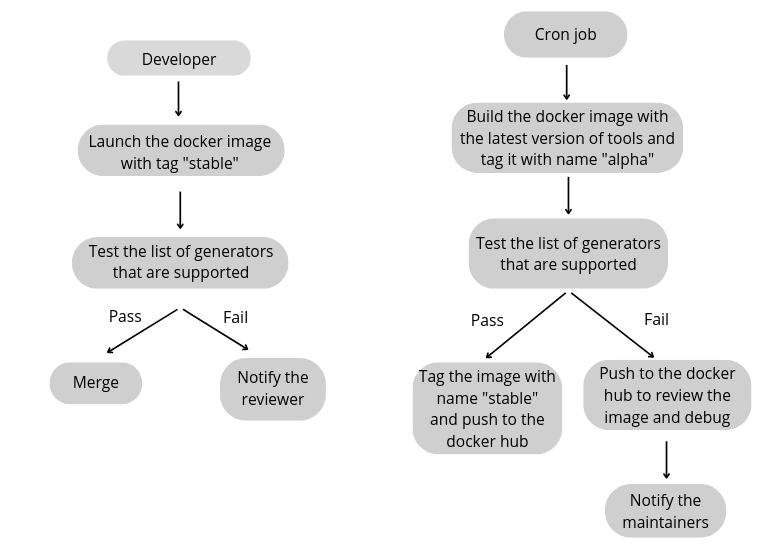

Continuous Integration
===========================

The Continuous Integration and Deployment for OpenFASoC will be running on a self-hosted VM on the GCP. The CI/CD flow is described like below -

[Note] This CI is still needs to be synced with the updates inside the OpenFASoC flow.

Docker Images
##############

The docker image is build on an ubuntu image using conda packages (currently) and KLayout is built from the .deb package
If the CI works, the tool versions will be  mentioned in the README file beside the tool name.

Alpha image of OpenFASoC environment - `docker pull msaligane/openfasoc:alpha`

Stable image of OpenFASoC environment - `docker pull msaligane/openfasoc:stable`
