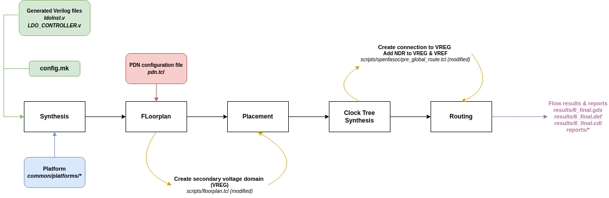
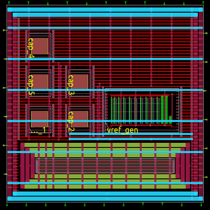
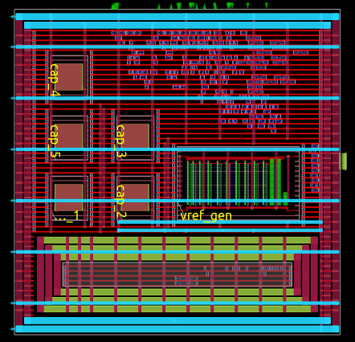
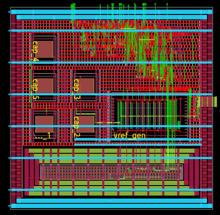

LDO Generator
===================

Low-dropout regulator

This page gives an overview of how the Digital LDO Generator (ldo-gen) works internally in OpenFASoC.

Circuit
-------
This generator is based on convential Digital LDO. The main function of LDO is to maintain constant output voltage which is equal to reference voltage VREF. The comparator is responsible for comparing the two voltage VREF and output voltage (VREG). Based on the comparator output a digital controller takes a decision to turn ON/OFF switches in order to maintain VREG equal to VREF.

.. figure:: img/ldo_ckt.png
  :align: center

  Block diagram of the Digital LDO's circuit

The Digital LDO consists of the following :

* A reference voltage generator (vref_gen)
* Comparator, which compares the two voltages
* Digital controller, which takes a decision based on comparator output
* Array of power switches (PT_unit_CELL)

More information on how the sensor works can be found `here <https://fasoc.engin.umich.edu/digital-ldo/>`_.

Generator Flow
--------------

To configure circuit specifications, modify the `test.json <https://github.com/idea-fasoc/OpenFASOC/blob/main/openfasoc/generators/ldo-gen/test.json>`_ specfile in the generators/ldo-gen/ folder.

To run the default generator, ``cd`` into `openfasoc/generators/ldo-gen/ <https://github.com/idea-fasoc/OpenFASOC/tree/main/openfasoc/generators/ldo-gen>`_ and execute the following command:

.. code-block:: bash

  make sky130hvl_ldo

.. note::
  For other generator options, use ``make help``.

The default circuit's physical design generation can be divided into three parts:

#. `Verilog generation`_
#. `RTL-to-GDS flow`_ (OpenROAD)
#. `Post-layout verification`_ (DRC and LVS)

Verilog generation
^^^^^^^^^^^^^^^^^^

Running ``make sky130hvl_ldo`` (ldo for "digital ldo") executes the `ldo-gen.py <https://github.com/idea-fasoc/OpenFASOC/blob/main/openfasoc/generators/ldo-gen/tools/ldo-gen.py>`_ script from ldo-gen/tools/. This file takes the input specifications from `test.json <https://github.com/idea-fasoc/OpenFASOC/blob/main/openfasoc/generators/ldo-gen/test.json>`_ and outputs Verilog files containing the description of the circuit.

.. note::
  ldo-gen.py calls other modules from ldo-gen/tools/ during execution. For example, `configure_workspace.py <https://github.com/idea-fasoc/OpenFASOC/blob/main/openfasoc/generators/ldo-gen/tools/configure_workspace.py>`_ is in charge of reading test.json, checking for correct user input and choosing the correct circuit elements.

The generator starts from a Verilog template of the ldo circuit, located in `ldo-gen/src/ <https://github.com/idea-fasoc/OpenFASOC/tree/main/openfasoc/generators/ldo-gen/src>`_. The ``.v`` template file have a parameter ARRSZ , which updates according to the specifications.

Example: `LDO_CONTROLLER_TEMPLATE.v line 5 <https://github.com/idea-fasoc/OpenFASOC/blob/main/openfasoc/generators/ldo-gen/src/LDO_CONTROLLER_TEMPLATE.v#L5>`_ changes the value based on number of switches during Verilog generation.

.. note::
  Currently, the only supported technology in ldo-gen is sky130hvl (hd for “high voltage”).

RTL-to-GDS flow
^^^^^^^^^^^^^^^

The "compilation" from the Verilog description to a physical circuit is made using a fork of `OpenROAD Flow <http://github.com/the-OpenROAD-Project/openroAD-flow-scripts/>`_, which is an RTS-to-GDS flow based on the `OpenROAD <https://github.com/The-OpenROAD-Project/OpenROAD>`_ tool. The fork is in the `ldo-gen/flow/ <https://github.com/idea-fasoc/OpenFASOC/tree/main/openfasoc/generators/ldo-gen/flow>`_ directory.

OpenROAD Flow takes a design from the ldo-gen/flow/design/ directory and runs it through its flow, generating a DEF and a GDS at the end. The design is specified by using the generated Verilog files and a ``config.mk`` file that configures OpenROAD Flow to the ldo design.

.. code-block::

  ldo-gen
  ├── blocks
  └── flow
      └── design
          ├── sky130hvl
          │   └── ldo
          │       ├── config.mk          <--
          │       └── constraint.sdc
          └── src
              └── ldo
                  ├── ldoInst.v          <--
                  ├── LDO_CONTROLLER.v   <--

For more information on OpenROAD Flow, check their `docs <https://openroad.readthedocs.io/en/latest/user/GettingStarted.html>`_.

.. note::
  OpenROAD Flow also creates intermediary files in the ldo-gen/flow/results/ folder, where each file is named according to the step in the flow it was created.

  For example, ``2_floorplan.odb`` is the file created after step 2 of OpenROAD Flow Scripts, which is floorplan generation.

The steps from the RTL-to-GDS flow look like this, usual in a digital flow:

Since OpenROAD was developed with digital designs in mind, some features do not natively support analog or mixed-signal designs for now. Hence, in the digital ldo, the physical implementation does not get successfully generated with the original flow.

Some changes are then made to customize the OpenROAD Flow repo and generate a working physical design, summarized in the diagram below:

Synthesis
~~~~~~~~~
The OpenROAD Flow starts with a flow configuration file (`config.mk <https://github.com/idea-fasoc/OpenFASOC/blob/main/openfasoc/generators/ldo-gen/flow/design/sky130hvl/ldo/config.mk>`_), the chosen platform (sky130hvl, for example) and the Verilog files generated from the previous part.

From them, synthesis is run using Yosys to find the appropriate circuit implementation from the available cells in the platform.

Floorplan
~~~~~~~~~

Then, the floorplan for the physical design is generated with OpenROAD, which requires a description of the power delivery network (in `pdn.tcl <https://github.com/idea-fasoc/OpenFASOC/blob/main/openfasoc/generators/ldo-gen/blocks/sky130hvl/pdn.tcl>`_).

This ldo design implements two voltage domains: one for the VDD that powers most of the circuit, and another for the VREG that is output of the ldo. Such voltage domains are created within the `floorplan.tcl <https://github.com/idea-fasoc/OpenFASOC/blob/main/openfasoc/generators/ldo-gen/flow/scripts/floorplan.tcl#L36>`_ script, with the following lines of code:

.. code-block:: tcl
  :force:
  :linenos:
  :lineno-start: 31
  :emphasize-lines: 4, 12

  # Initialize floorplan using DIE_AREA/CORE_AREA
  # ----------------------------------------------------------------------------
  } else {
    create_voltage_domain LDO_VREG -area $::env(VREG_AREA)

    initialize_floorplan -die_area $::env(DIE_AREA) \
                         -core_area $::env(CORE_AREA) \
                         -site $::env(PLACE_SITE)

     if {[info exist ::env(DOMAIN_INSTS_LIST)]} {
      source $::env(SCRIPTS_DIR)/openfasoc/read_domain_instances.tcl
      read_domain_instances LDO_VREG $::env(DOMAIN_INSTS_LIST)
    }
  }

In the image, line #36 will create a voltage domain named LDO_VREG with area coordinates as defined in config.mk.

Lines #38 to #40 will initialize the floorplan, as default in OpenROAD Flow, from the die area, core area and place site coordinates from config.mk.

And finally, lines #42 to #44 will source `read_domain_instances.tcl <https://github.com/idea-fasoc/OpenFASOC/blob/main/openfasoc/generators/ldo-gen/flow/scripts/openfasoc/read_domain_instances.tcl>`_, a script that assigns the corresponding instances to the LDO_VREG domain group. It gets the wanted instances from the DOMAIN_INSTS_LIST variable, set to `ldo_domain_insts.txt <https://github.com/idea-fasoc/OpenFASOC/blob/main/openfasoc/generators/ldo-gen/blocks/sky130hvl/ldo_domain_insts.txt>`_ in config.mk. This will ensure the cells are placed in the correct voltage domain during the detailed placement phase.

In the image below, notice the two voltage domains (LDO_VREG is the smaller one):

  Layout after floorplan (newer versions may differ)

.. warning::
  The ldo_domain_insts.txt file contains all instances to be placed in the LDO_VREG domain . The PT_UNIT_CELL cells are added to ldo_domain_insts.txt and the number of cells changes as per the specifications . Thus, this file actually gets generated during ldo-gen.py.

Placement
~~~~~~~~~

Placement *takes place* after the floorplan is ready and has two phases: global placement and detailed placement. The output of this phase will have all instances placed in their corresponding voltage domain, ready for routing.

  Layout after placement (newer versions may differ)

Routing
~~~~~~~

Routing is also divided into two phases: global routing and detailed routing. Right before global routing, OpenFASoC calls `pre_global_route.tcl <https://github.com/idea-fasoc/OpenFASOC/blob/main/openfasoc/generators/ldo-gen/flow/scripts/openfasoc/pre_global_route.tcl>`_:

.. code-block:: tcl
  :force:
  :linenos:

  # NDR rules
  source $::env(SCRIPTS_DIR)/openfasoc/add_ndr_rules.tcl

  # Custom connections
  source $::env(SCRIPTS_DIR)/openfasoc/create_custom_connections.tcl
  if {[info exist ::env(CUSTOM_CONNECTION)]} {
    create_custom_connections $::env(CUSTOM_CONNECTION)
  }

This script sources two other files: `add_ndr_rules.tcl <https://github.com/idea-fasoc/OpenFASOC/blob/main/openfasoc/generators/ldo-gen/flow/scripts/openfasoc/add_ndr_rules.tcl>`_, which adds an NDR rule to the VREG and VREF net to improve routes that connect instances in both voltage domains, and `create_custom_connections.tcl <https://github.com/idea-fasoc/OpenFASOC/blob/main/openfasoc/generators/ldo-gen/flow/scripts/openfasoc/create_custom_connections.tcl>`_, which creates the connection between the VREG net and the PT_UNIT_CELL instances along with comparator and also creates connection between the VREF net and the decoupling capacitors and vref_gen.

  Final layout after routing (newer versions may differ)

At the end, OpenROAD Flow will output its logs under flow/reports/, and its results under flow/results/.

Here's an overview of all changes made from OpenROAD Flow to OpenFASoC’s ldo-gen (the reference directory taken is `ldo-gen/flow/ <https://github.com/idea-fasoc/OpenFASOC/tree/main/openfasoc/generators/ldo-gen/flow>`_):

.. list-table:: Design files (needed for configuring OpenROAD Flow Scripts)
  :align: center

  * - `design/sky130hvl/ldo/config.mk <https://github.com/idea-fasoc/OpenFASOC/blob/main/openfasoc/generators/ldo-gen/flow/design/sky130hvl/ldo/config.mk>`_
    - OpenROAD Flow Scripts configuration
  * - `design/src/ldo/*.v <https://github.com/idea-fasoc/OpenFASOC/tree/main/openfasoc/generators/ldo-gen/flow/design/src/ldo>`_
    - Circuit Verilog description
  * - `../blocks/*/pdn.tcl <https://github.com/idea-fasoc/OpenFASOC/blob/main/openfasoc/generators/ldo-gen/blocks/sky130hvl/pdn.tcl>`_
    - Power Delivery Network setup

.. list-table:: Additional or modified files (make OpenROAD Flow Scripts support this analog design)
  :align: center

  * - | `scripts/floorplan.tcl <https://github.com/idea-fasoc/OpenFASOC/blob/main/openfasoc/generators/ldo-gen/flow/scripts/floorplan.tcl>`_ (modified)
      | `scripts/openfasoc/read_domain_instances.tcl <https://github.com/idea-fasoc/OpenFASOC/blob/main/openfasoc/generators/ldo-gen/flow/scripts/openfasoc/read_domain_instances.tcl>`_
    - Create a voltage domain for the output voltage VREG from the PT_UNIT_CELL cells, assigns its instances
  * - | `scripts/openfasoc/pre_global_route.tcl <https://github.com/idea-fasoc/OpenFASOC/blob/main/openfasoc/generators/ldo-gen/flow/scripts/openfasoc/pre_global_route.tcl>`_
      | `scripts/openfasoc/add_ndr_rules.tcl <https://github.com/idea-fasoc/OpenFASOC/blob/main/openfasoc/generators/ldo-gen/flow/scripts/openfasoc/add_ndr_rules.tcl>`_
      | `scripts/openfasoc/create_custom_connections.tcl <https://github.com/idea-fasoc/OpenFASOC/blob/main/openfasoc/generators/ldo-gen/flow/scripts/openfasoc/create_custom_connections.tcl>`_
    - Scripts run before global routing to setup the connection between the PT_UNIT_CELL,comparator and the VREG net.
  * - `Makefile <https://github.com/idea-fasoc/OpenFASOC/blob/main/openfasoc/generators/ldo-gen/flow/Makefile>`_ (modified)
    - Set flow directories from the fork, add DRC w/ Magic, add LVS w/ Netgen

The other files are unchanged from OpenROAD Flow.

.. note::
  For debugging purposes, it's also possible to generate only part of the flow, visualize the results in OpenROAD GUI or generate DEF files of all intermediary results. For doing so, the Makefile in ldo-gen/flow/ contains special targets.

  After running ``make sky130hvl_ldo`` in ldo-gen/ once, ``cd`` into the `flow/ <https://github.com/idea-fasoc/OpenFASOC/tree/main/openfasoc/generators/ldo-gen/flow>`_ directory and use one of the commands from the following table:

  .. list-table::
    :align: center

    * - ``make synth``
      - Stops the flow after synthesis
    * - ``make floorplan``
      - Stops the flow after floorplan
    * - ``make place``
      - Stops the flow after placement
    * - ``make route``
      - Stops the flow after routing
    * - ``make finish``
      - Runs the whole RTL-to-GDS flow
    * - ``make gui_floorplan``
      - Opens the design after floorplan in OpenROAD GUI
    * - ``make gui_place``
      - Opens the design after placement in OpenROAD GUI
    * - ``make gui_route``
      - Opens the design after routing in OpenROAD GUI
    * - ``make gui_final``
      - Opens the finished design in OpenROAD GUI
    * - ``make all_defs``
      - Creates DEF files in flow/results/ of every step in the flow
    * - ``make print-ENV_VARIABLE_NAME``
      - Prints the value of an env variable recognized by OpenROAD Flow

Post-layout verification
^^^^^^^^^^^^^^^^^^^^^^^^

After generating the design, OpenFASoC runs DRC and LVS to check that the circuit is manufacturable and corresponds to the specified design. In flow/Makefile, the targets `magic_drc` and `netgen_lvs` are run using make.

.. note::
  Source files for DRC and LVS are located under `common/drc-lvs-check/ <https://github.com/idea-fasoc/OpenFASOC/tree/main/openfasoc/common/drc-lvs-check>`_.

In DRC, `Magic <https://github.com/RTimothyEdwards/magic>`_ takes the generated GDS file and checks for failed constraints. A report is written under ldo-gen/flow/reports/ with any errors found.

In LVS, Magic takes the generated GDS file and extracts its netlist to compare with the original circuit netlist, in order to verify if the physical implementation was done correctly. Files generated from the layout extraction are created under ldo-gen/flow/objects/.

`Netgen <https://github.com/NGSolve/netgen>`_ is then used to run the comparison, outputting a report under ldo-gen/flow/reports/.

.. code-block:: console

   Netlists match uniquely.
   Circuits match correctly.

   Subcircuit pins:
   Circuit 1: ldoInst                         |Circuit 2: ldoInst
   -------------------------------------------|-------------------------------------------
   VREG                                       |VREG
   trim2                                      |trim2
   trim1                                      |trim1
   trim3                                      |trim3
   trim10                                     |trim10
   trim4                                      |trim4
   trim5                                      |trim5
   trim6                                      |trim6
   trim7                                      |trim7
   trim8                                      |trim8
   trim9                                      |trim9
   mode_sel[0]                                |mode_sel[0]
   std_ctrl_in                                |std_ctrl_in
   std_pt_in_cnt[4]                           |std_pt_in_cnt[4]
   std_pt_in_cnt[5]                           |std_pt_in_cnt[5]
   std_pt_in_cnt[7]                           |std_pt_in_cnt[7]
   std_pt_in_cnt[6]                           |std_pt_in_cnt[6]
   std_pt_in_cnt[8]                           |std_pt_in_cnt[8]
   VSS                                        |VSS
   cmp_out                                    |cmp_out
   ctrl_out[1]                                |ctrl_out[1]
   ctrl_out[2]                                |ctrl_out[2]
   ctrl_out[0]                                |ctrl_out[0]
   ctrl_out[3]                                |ctrl_out[3]
   ctrl_out[7]                                |ctrl_out[7]
   ctrl_out[4]                                |ctrl_out[4]
   ctrl_out[5]                                |ctrl_out[5]
   ctrl_out[6]                                |ctrl_out[6]
   ctrl_out[8]                                |ctrl_out[8]
   std_pt_in_cnt[3]                           |std_pt_in_cnt[3]
   mode_sel[1]                                |mode_sel[1]
   std_pt_in_cnt[1]                           |std_pt_in_cnt[1]
   reset                                      |reset
   std_pt_in_cnt[2]                           |std_pt_in_cnt[2]
   std_pt_in_cnt[0]                           |std_pt_in_cnt[0]
   clk                                        |clk
   VDD                                        |VDD
   ---------------------------------------------------------------------------------------
   Cell pin lists are equivalent.
   Device classes ldoInst and ldoInst are equivalent.
   Circuits match uniquely.

If no mismatch is reported, LVS is successful and the generator ends its job by copying the resulting circuit design files into ldo-gen/work/.

If an error is found, the generator may not be working properly. You can `file an issue <https://github.com/idea-fasoc/OpenFASOC/issues/new>`_ in the GitHub repo to ask for help.

Simulation
^^^^^^^^^^

The verify the functionality of the design automated simulations are ran using python scripts. The simulations can be run by giving command ``make sky130hvl_ldo_full`` in ldo-gen/

The spice template file `ldoInst_sim.sp <https://github.com/idea-fasoc/OpenFASOC/blob/main/openfasoc/generators/ldo-gen/simulations/templates/ldoInst_sim.sp>`_  is updated as per the various simulation conditions. Currently the simulations are performed for three different clock frequencies which 0.1MHz, 1MHz and 10MHz. Additionaly , it runs on different output capacitances at VREG.The simulation time is adjusted based upon the clock frequncy and array size. The simulation generates all imporatant variables in raw file which are saved after the simulation is complete.

.. note::
   Currently we support ngspice tool for simulations.
   
To better visualize and analyze the simulation results `simulations.py <https://github.com/idea-fasoc/OpenFASOC/blob/main/openfasoc/generators/ldo-gen/tools/simulations.py>`_ incorporates post processing functions which works on raw data that has been generated.Neat and labelled plots are generated for output voltage VREG , VREG ripple , number of switches turned on ,etc. All the plots are saved to ldo-gen/work/ at the end.

Reference Article
-----------------

Tutu Ajayi et al., "An Open-source Framework for Autonomous SoC Design with Analog Block Generation," 2020 IFIP/IEEE 28th International Conference on Very Large Scale Integration (VLSI-SOC), 2020, pp. 141-146.

Last updated: |today|
