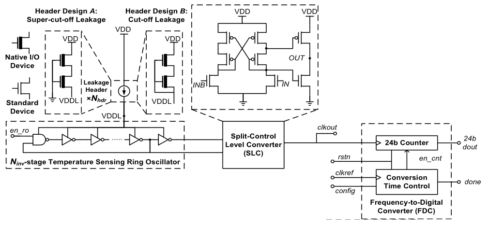
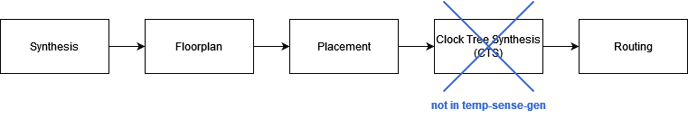
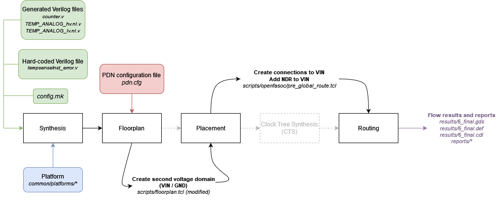
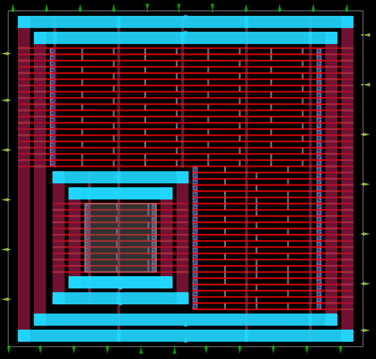
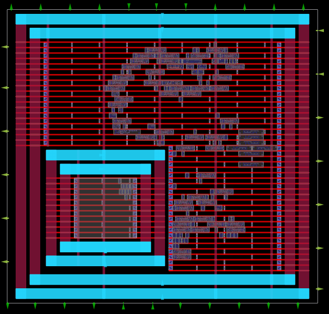
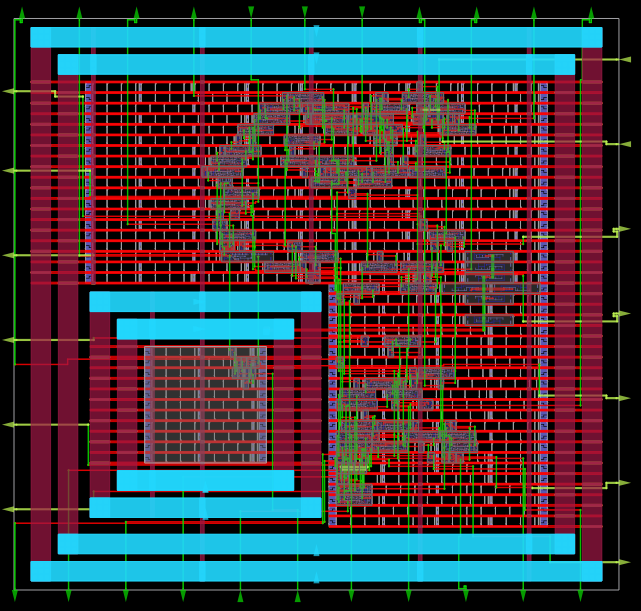

Temperature Sensor Flow
=======================

This page gives an overview of how the Temperature Sensor Generator (temp-sense-gen) works internally in OpenFASoC.

Circuit
-------
This generator creates a compact mixed-signal temperature sensor based on the topology from `this paper <https://ieeexplore.ieee.org/document/9816083>`_. It consists of a ring oscillator whose frequency is controlled by the voltage drop over a MOSFET operating in subthreshold regime, where its dependency on temperature is exponential.

  Block diagram of the temperature sensor’s circuit

The physical implementation of the analog blocks in the circuit is done using two manually designed standard cells:

* HEADER cell, containing the transistors in subthreshold operation;
* SLC cell, containing the Split-Control Level Converter.

More information on how the sensor works can be found `here <https://fasoc.engin.umich.edu/thermal-sensor/>`_.

Generator Flow
--------------

To configure circuit specifications, modify the `test.json <https://github.com/idea-fasoc/OpenFASOC/blob/main/openfasoc/generators/temp-sense-gen/test.json>`_ specfile in the generators/temp-sense-gen/ folder.

To run the default generator, ``cd`` into `openfasoc/generators/temp-sense-gen/ <https://github.com/idea-fasoc/OpenFASOC/tree/main/openfasoc/generators/temp-sense-gen>`_ and execute the following command:

.. code-block:: bash

  make sky130hd_temp

.. note::
  For other generator options, use ``make help``.

The default circuit's physical design generation can be divided into three parts:

#. `Verilog generation`_
#. `RTL-to-GDS flow`_ (OpenROAD)
#. `Post-layout verification`_ (DRC and LVS)

Verilog generation
^^^^^^^^^^^^^^^^^^

Running ``make sky130hd_temp`` (temp for "temperature sensor") executes the `temp-sense-gen.py <https://github.com/idea-fasoc/OpenFASOC/blob/main/openfasoc/generators/temp-sense-gen/tools/temp-sense-gen.py>`_ script from temp-sense-gen/tools/. This file takes the input specifications from `test.json <https://github.com/idea-fasoc/OpenFASOC/blob/main/openfasoc/generators/temp-sense-gen/test.json>`_ and outputs Verilog files containing the description of the circuit.

.. note::
  temp-sense-gen.py calls other modules from temp-sense-gen/tools/ during execution. For example, `readparamgen.py <https://github.com/idea-fasoc/OpenFASOC/blob/main/openfasoc/generators/temp-sense-gen/tools/readparamgen.py>`_ is in charge of reading test.json, checking for correct user input and choosing the correct circuit elements.

The generator starts from a Verilog template of the temperature sensor circuit, located in `temp-sense-gen/src/ <https://github.com/idea-fasoc/OpenFASOC/tree/main/openfasoc/generators/temp-sense-gen/src>`_. The ``.v`` template files have lines marked with ``@@``, which are replaced according to the specifications.

Example: `counter_generic.v line 31 <https://github.com/idea-fasoc/OpenFASOC/blob/main/openfasoc/generators/temp-sense-gen/src/counter_generic.v#L31>`_ is replaced during Verilog generation.

.. code-block:: verilog
  :emphasize-lines: 3
  :linenos:
  :lineno-start: 29

  assign done_sens = WAKE_pre &&  doneb;
	assign done_ref = WAKE && doneb;
  @@ @np Buf_DONE(.A(done_pre), .nbout(DONE));

  always @ (*) begin
    case (done_pre)
      1'd0:	DOUT = 0;
      1'd1:	DOUT = div_s;
    endcase
  end

To replace these lines with the correct circuit elements, temp-sense-gen takes cells from the selected technology. The number of inverters in the ring oscillator and of HEADER cells in parallel are optimized using a nearest-neighbor approach with experimental data from `models/modelfile.csv <https://github.com/idea-fasoc/OpenFASOC/blob/main/openfasoc/generators/temp-sense-gen/models/modelfile.csv>`_.

.. note::
  Currently, the only supported technology in temp-sense-gen is sky130hd (hd for “high density”).

RTL-to-GDS flow
^^^^^^^^^^^^^^^

The "compilation" from the Verilog description to a physical circuit is made using a fork of `OpenROAD Flow <http://github.com/the-OpenROAD-Project/openroAD-flow-scripts/>`_, which is an RTS-to-GDS flow based on the `OpenROAD <https://github.com/The-OpenROAD-Project/OpenROAD>`_ tool. The fork is in the `temp-sense-gen/flow/ <https://github.com/idea-fasoc/OpenFASOC/tree/main/openfasoc/generators/temp-sense-gen/flow>`_ directory.

OpenROAD Flow takes a design from the temp-sense-gen/flow/design/ directory and runs it through its flow, generating a DEF and a GDS at the end. The design is specified by using the generated Verilog files and a ``config.mk`` file that configures OpenROAD Flow to the temperature sensor design.

.. code-block::

  temp-sense-gen
  ├── blocks
  └── flow
      └── design
          ├── sky130hd
          │   └── tempsense
          │       ├── config.mk             <--
          │       └── constraint.sdc
          └── src
              └── tempsense
                  ├── counter.v             <--
                  ├── TEMP_ANALOG_hv.nl.v   <--
                  ├── TEMP_ANALOG_lv.nl.v   <--
                  ├── TEMP_AUTO_def.v       <--
                  └── tempsenseInst_error.v <--

For more information on OpenROAD Flow, check their `docs <https://openroad.readthedocs.io/en/latest/user/GettingStarted.html>`_.

.. note::
  OpenROAD Flow also creates intermediary files in the temp-sense-gen/flow/results/ folder, where each file is named according to the step in the flow it was created.

  For example, ``2_floorplan.odb`` is the file created after step 2 of OpenROAD Flow Scripts, which is floorplan generation.

The steps from the RTL-to-GDS flow look like this, usual in a digital flow:

Since OpenROAD was developed with digital designs in mind, some features do not natively support analog or mixed-signal designs for now. Hence, in the temperature sensor, the physical implementation does not get successfully generated with the original flow.

Some changes are then made to customize the OpenROAD Flow repo and generate a working physical design, summarized in the diagram below:

Synthesis
~~~~~~~~~
The OpenROAD Flow starts with a flow configuration file (`config.mk <https://github.com/idea-fasoc/OpenFASOC/blob/main/openfasoc/generators/temp-sense-gen/flow/design/sky130hd/tempsense/config.mk>`_), the chosen platform (sky130hd, for example) and the Verilog files generated from the previous part.

From them, synthesis is run using Yosys to find the appropriate circuit implementation from the available cells in the platform.

Floorplan
~~~~~~~~~

Then, the floorplan for the physical design is generated with OpenROAD, which requires a description of the power delivery network (in `pdn.cfg <https://github.com/idea-fasoc/OpenFASOC/blob/main/openfasoc/generators/temp-sense-gen/blocks/sky130hd/pdn.cfg>`_).

This temperature sensor design implements two voltage domains: one for the VDD that powers most of the circuit, and another for the VIN that powers the ring oscillator and is an output of the HEADER cells. Such voltage domains are created within the `floorplan.tcl <https://github.com/idea-fasoc/OpenFASOC/blob/main/openfasoc/generators/temp-sense-gen/flow/scripts/floorplan.tcl#L34>`_ script, with the following lines of code:

.. code-block:: tcl
  :force:
  :linenos:
  :lineno-start: 31
  :emphasize-lines: 4, 12

  # Initialize floorplan using DIE_AREA/CORE_AREA
  # ----------------------------------------------------------------------------
  } else {
    create_voltage_domain TEMP_ANALOG -area $::env(VD1_AREA)

    initialize_floorplan -die_area $::env(DIE_AREA) \
                         -core_area $::env(CORE_AREA) \
                         -site $::env(PLACE_SITE)

     if {[info exist ::env(DOMAIN_INSTS_LIST)]} {
      source $::env(SCRIPTS_DIR)/openfasoc/read_domain_instances.tcl
      read_domain_instances TEMP_ANALOG $::env(DOMAIN_INSTS_LIST)
    }
  }

In the image, line #34 will create a voltage domain named TEMP_ANALOG with area coordinates as defined in config.mk.

Lines #36 to #38 will initialize the floorplan, as default in OpenROAD Flow, from the die area, core area and place site coordinates from config.mk.

And finally, lines #40 to #42 will source `read_domain_instances.tcl <https://github.com/idea-fasoc/OpenFASOC/blob/main/openfasoc/generators/temp-sense-gen/flow/scripts/openfasoc/read_domain_instances.tcl>`_, a script that assigns the corresponding instances to the TEMP_ANALOG domain group. It gets the wanted instances from the DOMAIN_INSTS_LIST variable, set to `tempsenseInst_domain_insts.txt <https://github.com/idea-fasoc/OpenFASOC/blob/main/openfasoc/generators/temp-sense-gen/blocks/sky130hd/tempsenseInst_domain_insts.txt>`_ in config.mk. This will ensure the cells are placed in the correct voltage domain during the detailed placement phase.

In the image below, notice the two voltage domains (TEMP_ANALOG is the smaller one):

  Layout after floorplan (newer versions may differ)

.. warning::
  The tempsenseInst_domain_insts.txt file contains all instances to be placed in the TEMP_ANALOG domain (VIN voltage tracks). These cells are the components of the ring oscillator, including the inverters whose quantity may vary according to the optimization results. Thus, this file actually gets generated during temp-sense-gen.py.

Placement
~~~~~~~~~

Placement *takes place* after the floorplan is ready and has two phases: global placement and detailed placement. The output of this phase will have all instances placed in their corresponding voltage domain, ready for routing.

  Layout after placement (newer versions may differ)

Routing
~~~~~~~

Routing is also divided into two phases: global routing and detailed routing. Right before global routing, OpenFASoC calls `pre_global_route.tcl <https://github.com/idea-fasoc/OpenFASOC/blob/main/openfasoc/generators/temp-sense-gen/flow/scripts/openfasoc/pre_global_route.tcl>`_:

.. code-block:: tcl
  :force:
  :linenos:

  # NDR rules
  source $::env(SCRIPTS_DIR)/openfasoc/add_ndr_rules.tcl

  # Custom connections
  source $::env(SCRIPTS_DIR)/openfasoc/create_custom_connections.tcl
  if {[info exist ::env(CUSTOM_CONNECTION)]} {
    create_custom_connections $::env(CUSTOM_CONNECTION)
  }

This script sources two other files: `add_ndr_rules.tcl <https://github.com/idea-fasoc/OpenFASOC/blob/main/openfasoc/generators/temp-sense-gen/flow/scripts/openfasoc/add_ndr_rules.tcl>`_, which adds an NDR rule to the VIN net to improve routes that connect both voltage domains, and `create_custom_connections.tcl <https://github.com/idea-fasoc/OpenFASOC/blob/main/openfasoc/generators/temp-sense-gen/flow/scripts/openfasoc/create_custom_connections.tcl>`_, which creates the connection between the VIN net and the HEADER instances.

  Final layout after routing (newer versions may differ)

At the end, OpenROAD Flow will output its logs under flow/reports/, and its results under flow/results/.

Here's an overview of all changes made from OpenROAD Flow to OpenFASoC’s temp-sense-gen (the reference directory taken is `temp-sense-gen/flow/ <https://github.com/idea-fasoc/OpenFASOC/tree/main/openfasoc/generators/temp-sense-gen/flow>`_):

.. list-table:: Design files (needed for configuring OpenROAD Flow Scripts)
  :align: center

  * - `design/sky130hd/tempsense/config.mk <https://github.com/idea-fasoc/OpenFASOC/blob/main/openfasoc/generators/temp-sense-gen/flow/design/sky130hd/tempsense/config.mk>`_
    - OpenROAD Flow Scripts configuration
  * - `design/src/tempsense/*.v <https://github.com/idea-fasoc/OpenFASOC/tree/main/openfasoc/generators/temp-sense-gen/flow/design/src/tempsense>`_
    - Circuit Verilog description
  * - `../blocks/*/pdn.cfg <https://github.com/idea-fasoc/OpenFASOC/blob/main/openfasoc/generators/temp-sense-gen/blocks/sky130hd/pdn.cfg>`_
    - Power Delivery Network setup

.. list-table:: Additional or modified files (make OpenROAD Flow Scripts support this analog design)
  :align: center

  * - | `scripts/floorplan.tcl <https://github.com/idea-fasoc/OpenFASOC/blob/main/openfasoc/generators/temp-sense-gen/flow/scripts/floorplan.tcl>`_ (modified)
      | `scripts/openfasoc/read_domain_instances.tcl <https://github.com/idea-fasoc/OpenFASOC/blob/main/openfasoc/generators/temp-sense-gen/flow/scripts/openfasoc/read_domain_instances.tcl>`_
    - Create a voltage domain for the output voltage VIN from the header cells, assigns its instances
  * - | `scripts/openfasoc/pre_global_route.tcl <https://github.com/idea-fasoc/OpenFASOC/blob/main/openfasoc/generators/temp-sense-gen/flow/scripts/openfasoc/pre_global_route.tcl>`_
      | `scripts/openfasoc/add_ndr_rules.tcl <https://github.com/idea-fasoc/OpenFASOC/blob/main/openfasoc/generators/temp-sense-gen/flow/scripts/openfasoc/add_ndr_rules.tcl>`_
      | `scripts/openfasoc/create_custom_connections.tcl <https://github.com/idea-fasoc/OpenFASOC/blob/main/openfasoc/generators/temp-sense-gen/flow/scripts/openfasoc/create_custom_connections.tcl>`_
    - Scripts run before global routing to setup the connection between the header cells and the VIN voltage domain ring
  * - `Makefile <https://github.com/idea-fasoc/OpenFASOC/blob/main/openfasoc/generators/temp-sense-gen/flow/Makefile>`_ (modified)
    - Set flow directories from the fork, jump the CTS part (not needed for the temp-sense-gen since there's no clock), add DRC w/ Magic, add LVS w/ Netgen

The other files are unchanged from OpenROAD Flow.

.. note::
  For debugging purposes, it's also possible to generate only part of the flow, visualize the results in OpenROAD GUI or generate DEF files of all intermediary results. For doing so, the Makefile in temp-sense-gen/flow/ contains special targets.

  After running ``make sky130hd_temp`` in temp-sense-gen/ once, ``cd`` into the `flow/ <https://github.com/idea-fasoc/OpenFASOC/tree/main/openfasoc/generators/temp-sense-gen/flow>`_ directory and use one of the commands from the following table:

  .. list-table::
    :align: center

    * - ``make synth``
      - Stops the flow after synthesis
    * - ``make floorplan``
      - Stops the flow after floorplan
    * - ``make place``
      - Stops the flow after placement
    * - ``make route``
      - Stops the flow after routing
    * - ``make finish``
      - Runs the whole RTL-to-GDS flow
    * - ``make gui_floorplan``
      - Opens the design after floorplan in OpenROAD GUI
    * - ``make gui_place``
      - Opens the design after placement in OpenROAD GUI
    * - ``make gui_route``
      - Opens the design after routing in OpenROAD GUI
    * - ``make gui_final``
      - Opens the finished design in OpenROAD GUI
    * - ``make all_defs``
      - Creates DEF files in flow/results/ of every step in the flow
    * - ``make print-ENV_VARIABLE_NAME``
      - Prints the value of an env variable recognized by OpenROAD Flow

Post-layout verification
^^^^^^^^^^^^^^^^^^^^^^^^

After generating the design, OpenFASoC runs DRC and LVS to check that the circuit is manufacturable and corresponds to the specified design. In flow/Makefile, the targets `magic_drc` and `netgen_lvs` are run using make.

.. note::
  Source files for DRC and LVS are located under `common/drc-lvs-check/ <https://github.com/idea-fasoc/OpenFASOC/tree/main/openfasoc/common/drc-lvs-check>`_.

In DRC, `Magic <https://github.com/RTimothyEdwards/magic>`_ takes the generated GDS file and checks for failed constraints. A report is written under temp-sense-gen/flow/reports/ with any errors found.

In LVS, Magic takes the generated GDS file and extracts its netlist to compare with the original circuit netlist, in order to verify if the physical implementation was done correctly. Files generated from the layout extraction are created under temp-sense-gen/flow/objects/.

`Netgen <https://github.com/NGSolve/netgen>`_ is then used to run the comparison, outputting a report under temp-sense-gen/flow/reports/.

.. code-block:: console

  Netlists match with 1 symmetry.
  Circuits match correctly.

  Subcircuit pins:
  Circuit 1: tempsenseInst_error             |Circuit 2: tempsenseInst_error
  -------------------------------------------|-------------------------------------------
  RESET_COUNTERn                             |RESET_COUNTERn
  CLK_REF                                    |CLK_REF
  DOUT[0]                                    |DOUT[0]
  DOUT[1]                                    |DOUT[1]
  DOUT[2]                                    |DOUT[2]
  ...                                        ...
  DOUT[19]                                   |DOUT[19]
  DOUT[20]                                   |DOUT[20]
  DOUT[22]                                   |DOUT[22]
  DONE                                       |DONE
  en                                         |en
  SEL_CONV_TIME[3]                           |SEL_CONV_TIME[3]
  SEL_CONV_TIME[2]                           |SEL_CONV_TIME[2]
  lc_out                                     |lc_out
  out                                        |out
  outb                                       |outb
  SEL_CONV_TIME[1]                           |SEL_CONV_TIME[1]
  SEL_CONV_TIME[0]                           |SEL_CONV_TIME[0]
  VSS                                        |VSS
  VDD                                        |VDD
  ---------------------------------------------------------------------------------------
  Cell pin lists are equivalent.
  Device classes tempsenseInst_error and tempsenseInst_error are equivalent.
  Circuits match uniquely.

If no mismatch is reported, LVS is successful and the generator ends its job by copying the resulting circuit design files into temp-sense-gen/work/.

If an error is found, the generator may not be working properly. You can `file an issue <https://github.com/idea-fasoc/OpenFASOC/issues/new>`_ in the GitHub repo to ask for help.

.. note::
  Simulation of the generated circuit to also ensure its correct functioning is currently in development.

Reference article
-----------------

Q. Zhang et al., "An Open-Source and Autonomous Temperature Sensor Generator Verified With 64 Instances in SkyWater 130 nm for Comprehensive Design Space Exploration," in IEEE Solid-State Circuits Letters, vol. 5, pp. 174-177, 2022, doi: 10.1109/LSSC.2022.3188925.

Last updated: |today|
