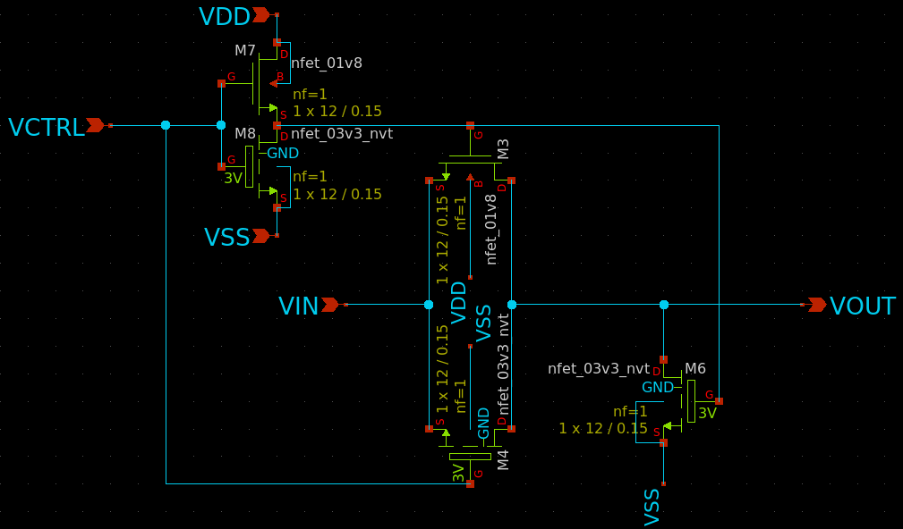
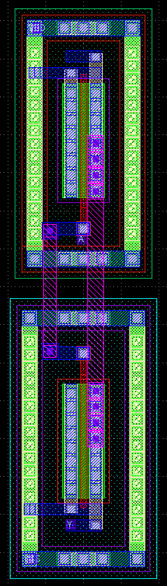
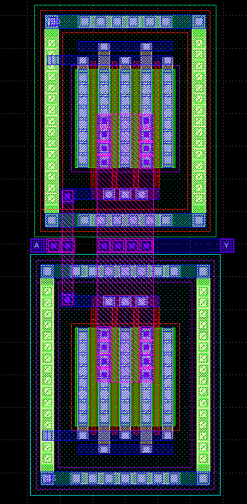
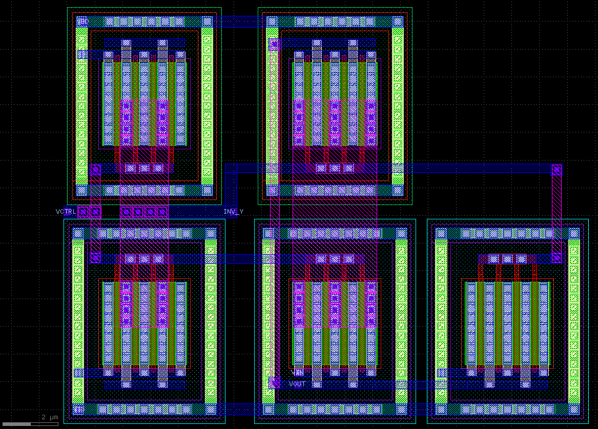
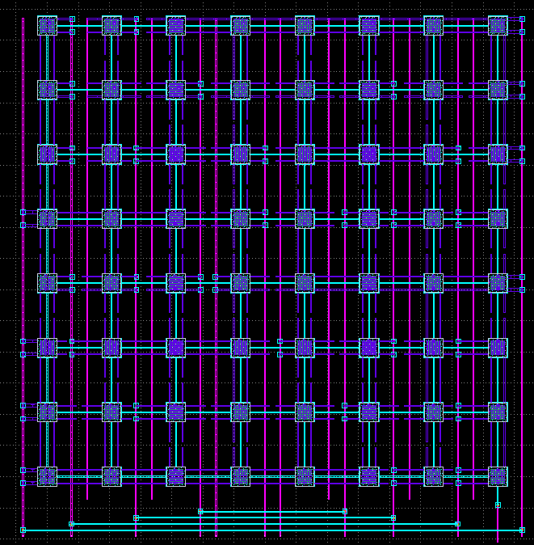

# PCell of 1-bit CDAC switch and 6-bit capacitive digital-to-analog converter
- Contributor: Team SaltyChip (from Chipathon 2024)

## Design intend
The aim is to generate the layout of the following to two schematics.
- 1-bit CDAC switch (to control the charge/discharge of the capacitor representing one bit of the DAC)
	- 
- 6-bit capacitive DAC
	- T.B.D.


## Glayout Source codes (1)

- **Function:** short_width_inv
- **Description:** to generate a layout of the inverter with shorter width (W < 12um)
- **Purpose:** to control the `CBAR` port of the transmission gate
- **Source file:** cdac_sw.py

```
def short_width_inv(
	pdk: MappedPDK,
	component_name: str = "inv",
	with_substrate_tap: dict[str, bool] = {"top_level": False, "pmos": False, "nmos": False},
	tap_cell: dict[str, bool]={"pmos": True, "nmos": True},
	fet_min_width: float = 3,
	pmos_width: float = 3,
	pmos_length: float = 0.15,
	nmos_width: float = 3,
	nmos_length: float = 0.15,
	is_top_level: bool = True,
	**kwargs
) -> Component:
```
| Parameter | Type | Description | Default | Constraint/Limit |
| --- | --- | --- |  --- |  --- |
| pdk | MappedPDK | To select the target PDK | | sky130 or gf180mcu (not validated yet) |
| component_name | string | The component name of the instantiated PCell | tg | |
| fet_min_width | float | A constraint to specify the mimimum width of each PMOS/NMOS inside the PCell | 3 (unit: um) | fet_min_width >= 2 |
| pmos_width | float | Width of the PMOS in the underlying PCell | 3 (unit: um) | pmos_width = fet_min_width |
| pmos_length | float | Length of the PMOS in the underlying PCell | 0.15 (unit: um) | pmos_length = 0.15 |
| nmos_width | float |Width of the NMOS in the underlying PCell | 3 (unit: um) | float | nmos_width = fet_min_width |
| nmos_length | float | Length of the NMOS in the underlying PCell | 0.15 (unit: um) | nmos_length = 0.15 |
| with_substrate_tap | bool | To add substrate tap surrounding the top level of the PCell if it is set True | False | |
| is_top_level | bool | To set the cell as the top level which will add the pins with labels and flatten the overall cell for LVS | True | |

An example of W=3um, L=0.15um inverter cell is generated as the following figures:



---

## Glayout Source codes (2)

- **Function:** long_width_inv
- **Description:** to build an interdigitized layout of the inverter with longer width (w >= 12um)
- **Purpose:** to control the `CBAR` port of the transmission gate
- **Source file:** cdac_sw.py

```
def long_width_inv(
	pdk: MappedPDK,
	component_name: str = "inv",
	with_substrate_tap: dict[str, bool] = {'top_level': False, 'pmos': False, 'nmos': False},
	tap_cell: dict[str, bool]={"pmos": True, "nmos": True},
	fet_min_width: float = 3,
	pmos_width: float = 12,
	pmos_length: float = 0.15,
	nmos_width: float = 12,
	nmos_length: float = 0.15,
	is_top_level: bool = True,
	**kwargs
)
```
| Parameter | Type | Description | Default | Constraint/Limit |
| --- | --- | --- |  --- |  --- |
| pdk | MappedPDK | To select the target PDK | | sky130 or gf180mcu (not validated yet) |
| component_name | string | The component name of the instantiated PCell | tg | |
| fet_min_width | float | A constraint to specify the mimimum width of each PMOS/NMOS inside the PCell | 3 (unit: um) | fet_min_width >= 2 |
| pmos_width | float | Width of the PMOS in the underlying PCell | 12 (unit: um) | **pmos_width** must be a multiple of **fet_min_width*4** |
| pmos_length | float | Length of the PMOS in the underlying PCell | 0.15 (unit: um) | pmos_length = 0.15 |
| nmos_width | float |Width of the NMOS in the underlying PCell | 12 (unit: um) | **nmos_width** must be a multiple of **fet_min_width*4** |
| nmos_length | float | Length of the NMOS in the underlying PCell | 0.15 (unit: um) | nmos_length = 0.15 |
| with_substrate_tap | bool | To add substrate tap surrounding the top level of the PCell if it is set True | False | |
| is_top_level | bool | To set the cell as the top level which will add the pins with labels and flatten the overall cell for LVS | True | |

An example of W=12um, L=0.15um inverter cell is generated as the following figures:



---

## Glayout Source codes (3)

- **Function:** inv_cll
- **Description/Purpose:** a generic function to build a layout of the inverter in an either single-finger or multifinger fashion depending on the specified widht of PMOS/NMOS
- **Source file:** cdac_sw.py

```
def inv_cell(
	pdk: MappedPDK,
	component_name: str = "tg",
	with_substrate_tap: dict[str, bool] = {'top_level': False, 'pmos': False, 'nmos': False},
	tap_cell: dict[str, bool]={"pmos": True, "nmos": True},
	fet_min_width: float = 3,
	pmos_width: float = 12,
	pmos_length: float = 0.15,
	nmos_width: float = 12,
	nmos_length: float = 0.15,
	is_top_level: bool = True,
	**kwargs
) -> Component:
```
| Parameter | Type | Description | Default | Constraint/Limit |
| --- | --- | --- |  --- |  --- |
| pdk | MappedPDK | To select the target PDK | | sky130 or gf180mcu (not validated yet) |
| component_name | string | The component name of the instantiated PCell | tg | |
| fet_min_width | float | A constraint to specify the mimimum width of each PMOS/NMOS inside the PCell | 3 (unit: um) | fet_min_width >= 2 |
| pmos_width | float | Width of the PMOS in the underlying PCell | 12 (unit: um) | **pmos_width** must be equal to **fet_min_width** or a multiple of **fet_min_width*4** |
| pmos_length | float | Length of the PMOS in the underlying PCell | 0.15 (unit: um) | pmos_length = 0.15 |
| nmos_width | float |Width of the NMOS in the underlying PCell | 12 (unit: um) | **nmos_width** must be equal to **fet_min_width** or a multiple of **fet_min_width*4** |
| nmos_length | float | Length of the NMOS in the underlying PCell | 0.15 (unit: um) | nmos_length = 0.15 |
| with_substrate_tap | bool | To add substrate tap surrounding the top level of the PCell if it is set True | False | |
| is_top_level | bool | To set the cell as the top level which will add the pins with labels and flatten the overall cell for LVS | True | |

---

## Glayout Source codes (4)

- **Function:** cdac_sw
- **Description:** 1-bit CDAC switch
- **Purpose:** this cell is to control the charge/discharge of one capacitor so as to realise the DAC's behaviour.
- **Source file:** cdac_sw.py

```
def cdac_sw(
	pdk: MappedPDK,
	component_name: str = "cdac_sw_1b",
	with_substrate_tap: dict[str, bool] = {'top_level': False, 'pmos': False, 'nmos': False},
	tap_cell: dict[str, bool]={"pmos": True, "nmos": True},
	fet_min_width: float = 3,
	pmos_width: float = 12,
	pmos_length: float = 0.15,
	nmos_width: float = 12,
	nmos_length: float = 0.15,
	is_top_level: bool = True,
	**kwargs
) -> Component:
```
| Parameter | Type | Description | Default | Constraint/Limit |
| --- | --- | --- |  --- |  --- |
| pdk | MappedPDK | To select the target PDK | | sky130 or gf180mcu (not validated yet) |
| component_name | string | The component name of the instantiated PCell | tg | |
| fet_min_width | float | A constraint to specify the mimimum width of each PMOS/NMOS inside the PCell | 3 (unit: um) | fet_min_width >= 2 |
| pmos_width | float | Width of the PMOS in the underlying PCell | 12 (unit: um) | Current Pcell only support **pmos_width=12**, other values are not validated yet |
| pmos_length | float | Length of the PMOS in the underlying PCell | 0.15 (unit: um) | pmos_length = 0.15 |
| nmos_width | float |Width of the NMOS in the underlying PCell | 12 (unit: um) | Current Pcell only support **nmos_width=12**, other values are not validated yet |
| nmos_length | float | Length of the NMOS in the underlying PCell | 0.15 (unit: um) | nmos_length = 0.15 |
| with_substrate_tap | bool | To add substrate tap surrounding the top level of the PCell if it is set True | False | |
| is_top_level | bool | To set the cell as the top level which will add the pins with labels and flatten the overall cell for LVS | True | |

An example of W=12um, L=0.15um CDAC switch cell is generated as the following figures:



---

## Glayout Source codes (5)

- **Function:** create_6bit_dac_mimcap_array
- **Description:** 6-bit MIM capacitor array
- **Purpose:** T.B.D.
- **Source file:** mimcap_array.py

```
create_6bit_dac_mimcap_array(
	pdk: MappedPDK
)

```
| Parameter | Type | Description | Default | Constraint/Limit |
| --- | --- | --- |  --- |  --- |
| pdk | MappedPDK | To select the target PDK | | sky130 or gf180mcu (not validated yet) |

An example of 6-bit MIM capacitor array is generated as the following figures:



---

## Glayout Source codes (6)

- **Function:** mim_cdac
- **Description:** 6-bit capacitive digital-to-analog converter
- **Source file:** mim_cdac.py

```

T.B.D.

```
| Parameter | Type | Description | Default | Constraint/Limit |
| --- | --- | --- |  --- |  --- |
|  |  |  | |  |

An example of 6-bit capacitive digital-to-analog converter is generated as the following figures:


---

## Example code to generate layout, DRC check and LVS check

In this example, a Python file, **eval.py** created under the directory **transmission_gate**, is wrote as follow which diplays the GDS and the check the DRC and LVS results. 

```
import sys
from datetime import datetime
import subprocess
#from glayout.flow.pdk.gf180_mapped import gf180
from glayout.flow.pdk.sky130_mapped import sky130_mapped_pdk as sky130
#from glayout.flow.blocks.elementary.transmission_gate import transmission_gate as tg
import transmission_gate as tg
import cdac_sw as cdac_sw
import mim_cdac as mim_cdac

TARGET_PDK = sky130
PWD_OUTPUT = subprocess.run(['pwd'], capture_output=True, text=True)
GDS_DIR = PWD_OUTPUT.stdout.strip() + "/gds"
DRC_RPT_DIR = PWD_OUTPUT.stdout.strip() + "/regression/drc"
LVS_RPT_DIR = PWD_OUTPUT.stdout.strip() + "/regression/lvs"

pmos_width  = 3*4
pmos_length = 0.15
nmos_width  = 3*4
nmos_length = 0.15
fet_min_width = 3

def basic_tg_eval():
	tg_dut = tg.tg_cell(
		pdk=TARGET_PDK,
		component_name="tg",
		with_substrate_tap={"top_level":False, "pmos":False, "nmos":False},
		tap_cell={"pmos":True, "nmos":True},
		fet_min_width=fet_min_width,
		pmos_width=pmos_width,
		pmos_length=pmos_length,
		nmos_width=nmos_width,
		nmos_length=nmos_length,
		is_top_level=True
	)
	tg_dut.show()
	print(tg_dut.info["netlist"].generate_netlist())
	tg_dut.write_gds(f"{GDS_DIR}/{tg_dut.name}.gds")

	now = datetime.now() # Get the current date and time
	regression_id = now.strftime('%Y%m%d%H%M%S') # Format the date and time without spaces

	magic_drc_result = sky130.drc_magic(
		layout=tg_dut,
		design_name=tg_dut.name,
		output_file=f"{DRC_RPT_DIR}/{tg_dut.name}_{regression_id}_drc.rpt"
	)
	print(f"Magic DRC result ({tg_dut.name}): \n", magic_drc_result)
	print("--------------------------------------\n\n")
	netgen_lvs_result = sky130.lvs_netgen(
		layout=tg_dut,
		design_name=tg_dut.name,
		output_file_path=f"{LVS_RPT_DIR}/{tg_dut.name}_{regression_id}_lvs.rpt",
		copy_intermediate_files=True
	)

def basic_inv_eval():
	inv_dut = cdac_sw.inv_cell(
		pdk=TARGET_PDK,
		component_name="inv",
		with_substrate_tap={"top_level":False, "pmos":False, "nmos":False},
		tap_cell={"pmos":True, "nmos":True},
		fet_min_width=fet_min_width,
		pmos_width=pmos_width,
		pmos_length=pmos_length,
		nmos_width=nmos_width,
		nmos_length=nmos_length,
		is_top_level=True
	)
	inv_dut.show()
	print(inv_dut.info["netlist"].generate_netlist())
	inv_dut.write_gds(f"{GDS_DIR}/{inv_dut.name}.gds")

	now = datetime.now() # Get the current date and time
	regression_id = now.strftime('%Y%m%d%H%M%S') # Format the date and time without spaces

	magic_drc_result = sky130.drc_magic(
		layout=inv_dut,
		design_name=inv_dut.name,
		output_file=f"{DRC_RPT_DIR}/{inv_dut.name}_{regression_id}_drc.rpt"
	)
	print(f"Magic DRC result ({inv_dut.name}): \n", magic_drc_result)
	print("--------------------------------------\n\n")
	netgen_lvs_result = sky130.lvs_netgen(
		layout=inv_dut,
		design_name=inv_dut.name,
		output_file_path=f"{LVS_RPT_DIR}/{inv_dut.name}_{regression_id}_lvs.rpt",
		copy_intermediate_files=True
	)

def cdac_sw_1b_eval():
	cdac_sw_dut = cdac_sw.cdac_sw(
		pdk=TARGET_PDK,
		component_name="cdac_sw_1b",
		with_substrate_tap={"top_level":False, "pmos":False, "nmos":False},
		tap_cell={"pmos":True, "nmos":True},
		fet_min_width=fet_min_width,
		pmos_width=pmos_width,
		pmos_length=pmos_length,
		nmos_width=nmos_width,
		nmos_length=nmos_length,
		is_top_level=True
	)
	cdac_sw_dut.show()
	print(cdac_sw_dut.info["netlist"].generate_netlist())
	cdac_sw_dut.write_gds(f"{GDS_DIR}/{cdac_sw_dut.name}.gds")

	now = datetime.now() # Get the current date and time
	regression_id = now.strftime('%Y%m%d%H%M%S') # Format the date and time without spaces

	magic_drc_result = sky130.drc_magic(
		layout=cdac_sw_dut,
		design_name=cdac_sw_dut.name,
		output_file=f"{DRC_RPT_DIR}/{cdac_sw_dut.name}_{regression_id}_drc.rpt"
	)
	print(f"Magic DRC result ({cdac_sw_dut.name}): \n", magic_drc_result)
	print("--------------------------------------\n\n")
	netgen_lvs_result = sky130.lvs_netgen(
		layout=cdac_sw_dut,
		design_name=cdac_sw_dut.name,
		output_file_path=f"{LVS_RPT_DIR}/{cdac_sw_dut.name}_{regression_id}_lvs.rpt",
		copy_intermediate_files=True
	)

def mim_cdac_6b_eval():
	mim_cdac_dut = mim_cdac.mim_cdac(
		pdk=TARGET_PDK,
		component_name="mim_cdac_6b",
		with_substrate_tap={"top_level":False, "pmos":False, "nmos":False},
		tap_cell={"pmos":True, "nmos":True},
		fet_min_width=fet_min_width,
		pmos_width=pmos_width,
		pmos_length=pmos_length,
		nmos_width=nmos_width,
		nmos_length=nmos_length,
		is_top_level=True
	)
	mim_cdac_dut.show()
	print(mim_cdac_dut.info["netlist"].generate_netlist())
	mim_cdac_dut.write_gds(f"{GDS_DIR}/{mim_cdac_dut.name}.gds")

	now = datetime.now() # Get the current date and time
	regression_id = now.strftime('%Y%m%d%H%M%S') # Format the date and time without spaces

	magic_drc_result = sky130.drc_magic(
		layout=mim_cdac_dut,
		design_name=mim_cdac_dut.name,
		output_file=f"{DRC_RPT_DIR}/{mim_cdac_dut.name}_{regression_id}_drc.rpt"
	)
	print(f"Magic DRC result ({mim_cdac_dut.name}): \n", magic_drc_result)
	print("--------------------------------------")
	netgen_lvs_result = sky130.lvs_netgen(
		layout=mim_cdac_dut,
		design_name=mim_cdac_dut.name,
		output_file_path=f"{LVS_RPT_DIR}/{mim_cdac_dut.name}_{regression_id}_lvs.rpt",
		copy_intermediate_files=True
	)

def main():
	basic_tg_eval() # for regression test
	basic_inv_eval() # for regression test
	cdac_sw_1b_eval()
	mim_cdac_6b_eval() # T.B.D.

if __name__ == "__main__":
	main()
```
---

## Layout Report

- The DRC and LVS results are placed under the directries: `regression/drc/*_drc.rpt` and `regression/lvs/*_lvs.rpt`, respectively.
- The generated GDSII files are placed under the directy: `gds/*.gds`.

---

## Progress (latest update: 27/02/2025)

- ToDo list
- CDAC switch
    - [x] Layout
    - [x] Add ports w/ labels onto the layout (for the subsequent LVS)
    - [x] DRC of the layout w/o error (Magic)
    - [x] Create the baseline schematic of the created component
    - [x] LVS w/o error
    - [x] Document about the PCell specification
    - [ ] PEX and create the testbench
    - [ ] Verification gets passed
- Capacitive DAC (top level)
    - [WIP] Layout
    - [ ] Add ports w/ labels onto the layout (for the subsequent LVS)
    - [ ] DRC of the layout w/o error (Magic)
    - [ ] Create the baseline schematic of the created component
    - [ ] LVS w/o error
    - [ ] Document about the PCell specification
    - [ ] PEX and create the testbench
    - [ ] Verification gets passed