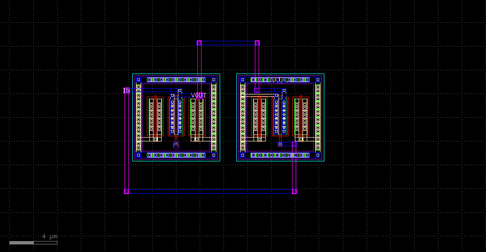

## FLIPPED VOLTAGE FOLLOWER CELL

```
def  flipped_voltage_follower(
        pdk: MappedPDK,
        device_type: str = "nmos", 
        placement: str = "horizontal",
        width: tuple[float,float] = (3,3),
        length: tuple[float,float] = (None,None),
        fingers: tuple[int,int] = (1,1),
        multipliers: tuple[int,int] = (1,1),
        dummy_1: tuple[bool,bool] = (True,True),
        dummy_2: tuple[bool,bool] = (True,True),
        tie_layers1: tuple[str,str] = ("met2","met1"),
        tie_layers2: tuple[str,str] = ("met2","met1"),
        sd_rmult: int=1,
        **kwargs
        ) -> Component:
    """
    creates a Flipped Voltage Follower
    pdk: pdk to use
    device_type: either "nmos" or "pmos"
    placement: either "horizontal" or "vertical"
    width: (input fet, feedback fet)
    length: (input fet, feedback fet)
    fingers: (input fet, feedback fet)
    multipliers: (input fet, feedback fet)
    dummy_1: dummy for input fet
    dummy_2: dummy for feedback fet
    tie_layers1: tie layers for input fet
    tie_layers2: tie layers for feedback fet
    sd_rmult: sd_rmult for both fets
    **kwargs: any kwarg that is supported by nmos and pmos
```
### GDS generated

### DRC Report
```
using default pdk_root: /usr/bin/miniconda3/share/pdk/
Defaulting to stale magic_commands.tcl

Magic 8.3 revision 464 - Compiled on Sat Mar  9 23:18:29 UTC 2024.
Starting magic under Tcl interpreter
Using the terminal as the console.
Using NULL graphics device.
Processing system .magicrc file
Sourcing design .magicrc for technology sky130A ...
2 Magic internal units = 1 Lambda
Input style sky130(): scaleFactor=2, multiplier=2
The following types are not handled by extraction and will be treated as non-electrical types:
    ubm 
Scaled tech values by 2 / 1 to match internal grid scaling
Loading sky130A Device Generator Menu ...
Loading "/tmp/tmp0t0g30yo/magic_commands.tcl" from command line.
Warning: Calma reading is not undoable!  I hope that's OK.
Library written using GDS-II Release 6.0
Library name: library
Reading "fvf".
[INFO]: Loading fvf

Loading DRC CIF style.
No errors found.
[INFO]: DONE with /tmp/tmp0t0g30yo/fvf.rpt

Using technology "sky130A", version 1.0.471-0-g97d0844

Soft errors: 
Error while reading cell "fvf" (byte position 118): Unknown layer/datatype in boundary, layer=64 type=44
```
### LVS Report
```
Circuit 1 cell sky130_fd_pr__nfet_01v8 and Circuit 2 cell sky130_fd_pr__nfet_01v8 are black boxes.
Warning: Equate pins:  cell sky130_fd_pr__nfet_01v8 is a placeholder, treated as a black box.
Warning: Equate pins:  cell sky130_fd_pr__nfet_01v8 is a placeholder, treated as a black box.

Subcircuit pins:
Circuit 1: sky130_fd_pr__nfet_01v8         |Circuit 2: sky130_fd_pr__nfet_01v8         
-------------------------------------------|-------------------------------------------
1                                          |1                                          
2                                          |2                                          
3                                          |3                                          
4                                          |4                                          
---------------------------------------------------------------------------------------
Cell pin lists are equivalent.
Device classes sky130_fd_pr__nfet_01v8 and sky130_fd_pr__nfet_01v8 are equivalent.
Flattening unmatched subcell NMOS in circuit fvf (1)(2 instances)

Class fvf (0):  Merged 3 parallel devices.
Class fvf (1):  Merged 3 parallel devices.
Subcircuit summary:
Circuit 1: fvf                             |Circuit 2: fvf                             
-------------------------------------------|-------------------------------------------
sky130_fd_pr__nfet_01v8 (6->3)             |sky130_fd_pr__nfet_01v8 (6->3)             
Number of devices: 3                       |Number of devices: 3                       
Number of nets: 4                          |Number of nets: 4                          
---------------------------------------------------------------------------------------
Netlists match uniquely.

Subcircuit pins:
Circuit 1: fvf                             |Circuit 2: fvf                             
-------------------------------------------|-------------------------------------------
VIN                                        |VIN                                        
Ib                                         |Ib                                         
VOUT                                       |VOUT                                       
VBULK                                      |VBULK                                      
---------------------------------------------------------------------------------------
Cell pin lists are equivalent.
Device classes fvf and fvf are equivalent.

Final result: Circuits match uniquely.
```
