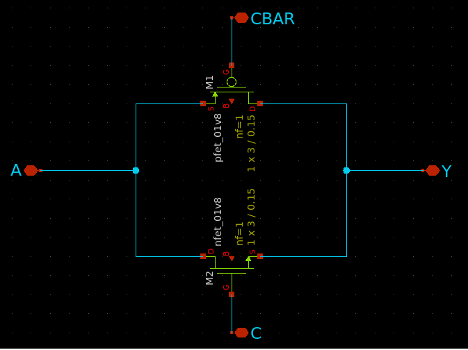
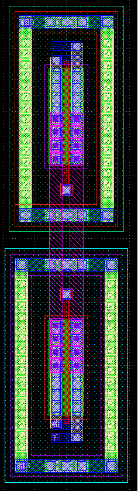
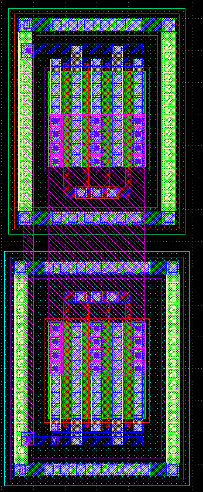

# PCell of transmission gate
- Contributor: Team SaltyChip (from Chipathon 2024)

## Design intend

The aim is to generate the layout of the following transmission gate schematic.



## Glayout Source codes (1)

- **Function:** short_width_tg
- **Description/Purpose:** to build a layout of the transmission gate without multifinger transistors
- **Source file:** transmission_gate.py

```
def short_width_tg(
	pdk: MappedPDK,
	component_name: str = "tg",
	with_substrate_tap: bool = False,
	fet_min_width: float = 3,
	pmos_width: float = 3,
	pmos_length: float = 0.15,
	nmos_width: float = 3,
	nmos_length: float = 0.15,
	is_top_level: bool = True,
	**kwargs
) -> Component:
```
| Parameter | Type | Description | Default | Constraint/Limit |
| --- | --- | --- |  --- |  --- |
| pdk | MappedPDK | To select the target PDK | | sky130 or gf180mcu |
| component_name | string | The component name of the instantiated PCell | tg | |
| fet_min_width | float | A constraint to specify the mimimum width of each PMOS/NMOS inside the PCell | 3 (unit: um) | fet_min_width >= 2 |
| pmos_width | float | Width of the PMOS in the underlying PCell | 3 (unit: um) | pmos_width = fet_min_width |
| pmos_length | float | Length of the PMOS in the underlying PCell | 0.15 (unit: um) | pmos_length = 0.15 |
| nmos_width | float |Width of the NMOS in the underlying PCell | 3 (unit: um) | float | nmos_width = fet_min_width |
| nmos_length | float | Length of the NMOS in the underlying PCell | 0.15 (unit: um) | nmos_length = 0.15 |
| with_substrate_tap | bool | To add substrate tap surrounding the top level of the PCell if it is set True | False | |
| is_top_level | bool | To set the cell as the top level which will add the pins with labels and flatten the overall cell for LVS | True | |

An example of W=3um, L=0.15um cell is generated as the following figures:



---

## Glayout Source codes (2)

- **Function:** long_width_tg
- **Description/Purpose:** to build an interdigitized layout of the transmission gate when the width of the underlying trasistors is relatively long
- **Source file:** transmission_gate.py

```
def long_width_tg(
	pdk: MappedPDK,
	component_name: str = "tg",
	fet_min_width: float = 3,
	pmos_width: float = 12,
	pmos_length: float = 0.15,
	nmos_width: float = 12,
	nmos_length: float = 0.15,
	with_substrate_tap: bool = True,
	is_top_level: bool = True, # For LVS
	**kwargs
) -> Component:
```
| Parameter | Type | Description | Default | Constraint/Limit |
| --- | --- | --- |  --- |  --- |
| pdk | MappedPDK | To select the target PDK | | sky130 or gf180mcu |
| component_name | string | The component name of the instantiated PCell | tg | |
| fet_min_width | float | A constraint to specify the mimimum width of each PMOS/NMOS inside the PCell | 3 (unit: um) | fet_min_width >= 2 |
| pmos_width | float | Width of the PMOS in the underlying PCell | 12 (unit: um) | **pmos_width** must be a multiple of **fet_min_width*4** |
| pmos_length | float | Length of the PMOS in the underlying PCell | 0.15 (unit: um) | pmos_length = 0.15 |
| nmos_width | float |Width of the NMOS in the underlying PCell | 12 (unit: um) | **nmos_width** must be a multiple of **fet_min_width*4** |
| nmos_length | float | Length of the NMOS in the underlying PCell | 0.15 (unit: um) | nmos_length = 0.15 |
| with_substrate_tap | bool | To add substrate tap surrounding the top level of the PCell if it is set True | False | |
| is_top_level | bool | To set the cell as the top level which will add the pins with labels and flatten the overall cell for LVS | True | |

An example of W=12um, L=0.15um cell is generated as the following figures:



---

## Glayout Source codes (3)

- **Function:** tg_cell
- **Description/Purpose:** a generic function to build a layout of the transmission gate in an either single-finger or multifinger fashion depending on the specified widht of PMOS/NMOS
- **Source file:** transmission_gate.py

```
def tg_cell(
	pdk: MappedPDK,
	component_name: str = "tg",
	fet_min_width: float = 3,
	pmos_width: float = 6,
	pmos_length: float = 0.15,
	nmos_width: float = 6,
	nmos_length: float = 0.15,
	with_substrate_tap: bool = True,
	is_top_level: bool = True,
	**kwargs
) -> Component:
```
| Parameter | Type | Description | Default | Constraint/Limit |
| --- | --- | --- |  --- |  --- |
| pdk | MappedPDK | To select the target PDK | | sky130 or gf180mcu |
| component_name | string | The component name of the instantiated PCell | tg | |
| fet_min_width | float | A constraint to specify the mimimum width of each PMOS/NMOS inside the PCell | 3 (unit: um) | fet_min_width >= 2 |
| pmos_width | float | Width of the PMOS in the underlying PCell | 12 (unit: um) | **pmos_width** must be equal to **fet_min_width** or a multiple of **fet_min_width*4** |
| pmos_length | float | Length of the PMOS in the underlying PCell | 0.15 (unit: um) | pmos_length = 0.15 |
| nmos_width | float |Width of the NMOS in the underlying PCell | 12 (unit: um) | **nmos_width** must be equal to **fet_min_width** or a multiple of **fet_min_width*4** |
| nmos_length | float | Length of the NMOS in the underlying PCell | 0.15 (unit: um) | nmos_length = 0.15 |
| with_substrate_tap | bool | To add substrate tap surrounding the top level of the PCell if it is set True | False | |
| is_top_level | bool | To set the cell as the top level which will add the pins with labels and flatten the overall cell for LVS | True | |

---

## Example code to generate layout, DRC check and LVS check

In this example, a Python file, **eval.py** created under the directory **transmission_gate**, is wrote as follow which diplays the GDS and the check the DRC and LVS results. 

```
from datetime import datetime
import subprocess
#from glayout.flow.pdk.gf180_mapped import gf180
from glayout.flow.pdk.sky130_mapped import sky130_mapped_pdk as sky130
import transmission_gate as tg

TARGET_PDK = sky130
PWD_OUTPUT = subprocess.run(['pwd'], capture_output=True, text=True)
GDS_DIR = PWD_OUTPUT.stdout.strip() + "/gds"
DRC_RPT_DIR = PWD_OUTPUT.stdout.strip() + "/regression/drc"
LVS_RPT_DIR = PWD_OUTPUT.stdout.strip() + "/regression/lvs"

pmos_width  = 3*4
pmos_length = 0.15
nmos_width  = 3*4
nmos_length = 0.15
fet_min_width = 3

def basic_tg_eval():
	tg_dut = tg.tg_cell(
		pdk=TARGET_PDK,
		component_name="tg",
		fet_min_width=fet_min_width,
		pmos_width=pmos_width,
		pmos_length=pmos_length,
		nmos_width=nmos_width,
		nmos_length=nmos_length,
		with_substrate_tap=True,
		is_top_level=True
	)

	tg_dut.show()
	print(tg_dut.info["netlist"].generate_netlist())
	tg_dut.write_gds(f"{GDS_DIR}/{tg_dut.name}.gds")

	now = datetime.now() # Get the current date and time
	regression_id = now.strftime('%Y%m%d%H%M%S') # Format the date and time without spaces

	magic_drc_result = sky130.drc_magic(
		layout=tg_dut,
		design_name=tg_dut.name,
		output_file=f"{DRC_RPT_DIR}/{tg_dut.name}_{regression_id}_drc.rpt"
	)
	print(f"Magic DRC result ({tg_dut.name}): \n", magic_drc_result)
	print("--------------------------------------\n\n")
	netgen_lvs_result = sky130.lvs_netgen(
		layout=tg_dut,
		design_name=tg_dut.name,
		output_file_path=f"{LVS_RPT_DIR}/{tg_dut.name}_{regression_id}_lvs.rpt",
		copy_intermediate_files=True
	)

def main():
	basic_tg_eval()

if __name__ == "__main__":
	main()
```
---

## Layout Report

- The DRC and LVS results are placed under the directries: `regression/drc/*_drc.rpt` and `regression/lvs/*_lvs.rpt`, respectively.
- The generated GDSII files are placed under the directy: `gds/*.gds`.

---

## Progress (latest update: 27/02/2025)

- ToDo list
- Transmission gate
    - [x] Layout
    - [x] Add ports w/ labels onto the layout (for the subsequent LVS)
    - [x] DRC of the layout w/o error (Magic)
    - [x] Create the baseline schematic of the created component
    - [x] LVS w/o error
    - [x] Document about the PCell specification
    - [ ] PEX and create the testbench
    - [ ] Verification gets passed