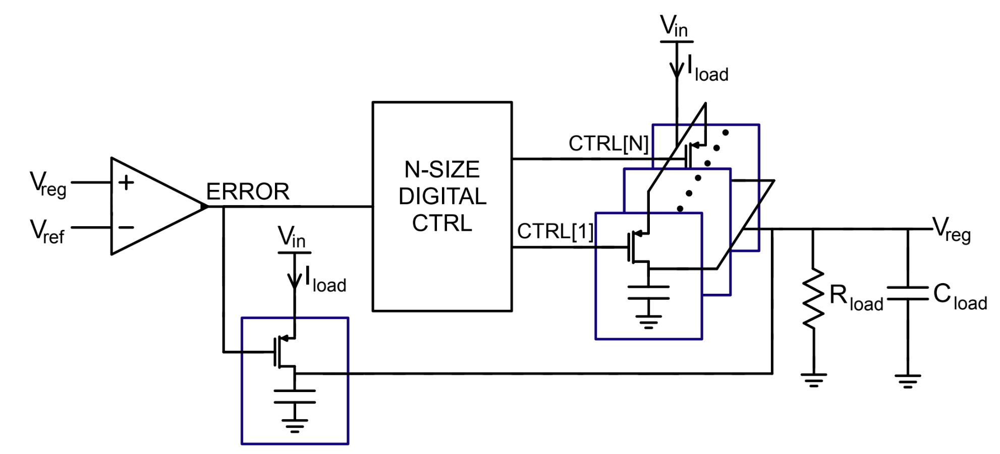

# LDO Generator

The main function of LDO is to maintain constant output voltage which is equal to reference voltage VREF. The comparator is responsible for comparing the two voltage VREF and output voltage (VREG). Based on the comparator output a digital controller takes a decision to turn ON/OFF switches in order to maintain VREG equal to VREF.

Fundamentally, the DLDO is a closed loop control system with:

1. Comparator that produces an error (voltage comparison) of the closed-loop-feedback (VREG) signal vs the desired reference value (VREF).
2. Controller which interprets the error and adjusts the power delivery array.
3. Tunable power delivery array which can quickly adjust the output voltage (VREG) based on the controller input.

**Componets of LDO**

* A 10 bit trimmable reference voltage generator (vref_gen)
* Comparator, which is a clocked strong arm latch comparator which compares VREF and VREG
* Digital controller, which takes a decision based on comparator output
* Array of power switches (PT_UNIT_CELL) ,each unit cell act as current switch
* Auxillary PMOS, used to reduce higher mode LCO oscillations at output VREG

**LDO Block Diagram**

