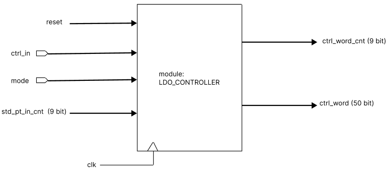

# LDO Generator

The main idea behind a Digital LDO is the use of an array of small power transistors that operate as switches. The use of power transistors as switches facilitates low VDD power management and process scalability which makes Digital LDOs a good potential candidate for power management as we go to lower nodes. In this project LDO generator project Unit Power Switch is used as the auxiliary cell.

 The basic mode of operation of the code module is, that the unit switches (which are 50 in number) will hold '0' value initially and when reset is 1 and when mode is 1 the leftmost or rightmost switch is going to be 1 depending on the value of ctrl_in(which is the controller in the SOC), its value is dependent on input from the comparator. If nither mode or reset is 1, all the switches are going to reset and the value of str_pt_in_cnt is going to be transferred to ctrl_word_cnt.

 ## Inputs
 *  CLK:- System clock taken from the input.
 *  RESET:- Input signal to reset to the module's initial state.
 *  mode:- Input signal for normal mode of operation.
 *  ctrl_in :-  Input signal to choose if a switch to be ON is from the leftmost or rightmost in the "ctrl_word" power switches array.

 * str_pt_in_cnt :- A 9-bit register to store the number of power switches(ctrl_word) that are on.

 ## Outputs
 *  ctrl_word_cnt :- A 9-bit register to store the number of power switches(ctrl_word) that are on.

 *  ctrl_word:- Array of registers that corresponds to the unit power switches.
