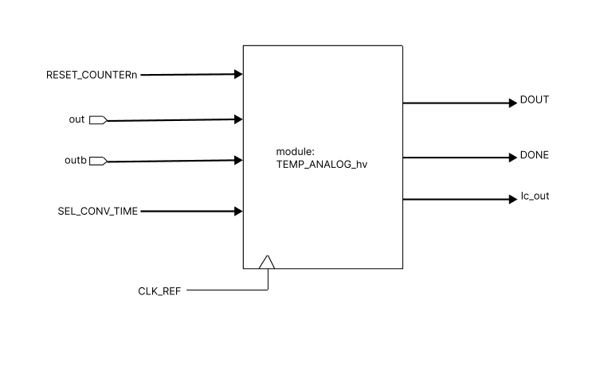

# Temp Sensor Generator

An all-digital temperature sensor, that relies on a new subthreshold oscillator (achieved using the auxiliary cell “Header Cell“) for realizing synthesizable thermal sensors.

The way that works is we have a subthreshold current that has an exponential dependency on the temperature, the frequency generated from the subthreshold ring oscillator is also dependent on temperature. So we can sense the temperature by comparing the difference between the clock frequency generated from a reference oscillator and the clock frequency from the proposed frequency generator.

## Temperature Sensor Description

**User Specs**
* Temperature sensing range: -20⁰C – 125⁰C
* Frequency range of operation: 100Hz – 10MHz

**Block Architecture**

 _Inputs_
 *  CLK_REF: System clock taken from input.
 *  RESET_COUNTERn: Input signal to reset the module initial state.

 * SEL_CONV_TIME: Four bit input used to select how many times the 1 bit of the output DOUT is fractionated (0-16).

_Outputs_
 *  DOUT:  The output voltage whose frequency is dependent on temperature.
 *  DONE: Validity signal for DOUT

**Thermal Sensor Block Diagram (RTL)**

 

**Top  Layout View**
 

