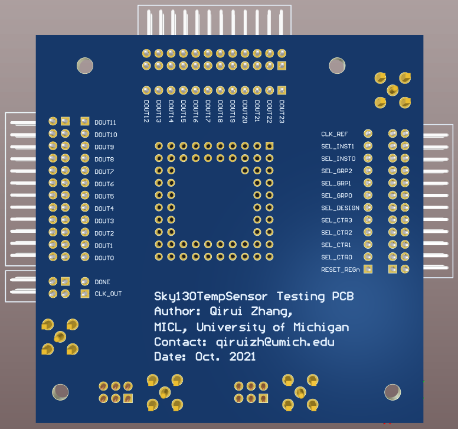
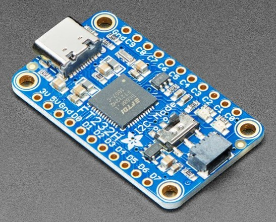

# OpenFASOC Temperature Sensors in SkyWater 130nm: Test Setup

This repository provides a fully open-source test setup solution for a temperature sensor chip taped-out in SkyWater 130nm with 64 openFASOC-generated temperature sensor instances. The setup is highly automated with Python and open-source libraries, where the chip is controlled through low-cost commercially-available USB devices, and control of testing equipments like temperature chamber and source measurement unit is also seamlessly embedded in the test flow using Python.

**Author:** [Qirui Zhang](https://www.linkedin.com/in/cary-qirui-zhang/) from the [University of Michigan, Ann Arbor](https://micl.engin.umich.edu/)

## 1. Prerequisites
### 1.1 **Host Computer**
A host computer with Windows 10 operating system is required. Either a desktop or laptop should work.

### 1.2 **Python**
Please install the latest version of [Anaconda](https://www.anaconda.com/products/individual) (Python3) on the host computer and use Spyder for running the test scripts.

## 2. Test Setup
### 2.1 **Daughter Board for the Chip**
The daughter board could be as simple as one that directly connects all the chip I/Os to headers and power supplies to SMA or banana connectors. No level conversion should be needed as the chip uses 3.3V I/O voltage. It is suggested to use 64-pin ceramic PGA packages for packaging the dice and a Zero-Insertion-Force (ZIF) socket for holding the chip. The daughter board designed for validating this setup is shown below as a reference:


Fig. 1. Top view of the daughter board
<br /><br />

Fig. 2. Bottom view of the daughter board

### 2.2 **FT232H USB-to-GPIO Bridge**
Three [FT232H USB-to-GPIO bridge boards](https://www.adafruit.com/product/2264#description) from AdaFruit are needed in this setup for controlling the chip. Please purchase them online from Adafruit. After getting the boards, follow this [page](https://learn.adafruit.com/circuitpython-on-any-computer-with-ft232h/windows) to install driver for the boards using Zadig on the host computer. Note: you only need to follow the`Plug in FT232H & Fix Driver with Zadig` part on this page, as we do not use the boards in the same way as they suggest.

After the driver is installed, open an Anaconda prompt on the host computer, install pyftdi and pyusb libraries:

```  pip install pyftdi```
<br />
```  pip install pyusb```

After the installations, connect the three bridges to the daughter board via jumper wires according to `PinMap.txt` in this repository. The pin numbers of bridge boards are already printed on-board, like what is shown in Fig. 3, while the chip I/O names are printed on the bottom of the daughter board shown in Fig. 2. The three bridges are named `Input-bridge`, `Output-bridge1` and `Output-bridge0`, where the input bridge is used for all the input pins of the chip and the output bridges are used for chip output pins. After connecting the chip I/Os, also remember to connect the ground pins of each bridge to the daughter board ground for a common ground.


Fig. 3. FT232H USB-to-GPIO Bridge Board
<br /><br />

The last step for setting-up the bridges is to connect them to the host computer via USB cables (note the latest bridge version uses USB type-C) and figure out what their USB addresses are. Use `find_usb_addr.py` in this repository to achieve that. For example, when running line `25` and line `27` for checking which bridge board has the USB address of `gpio0`, use a saleae logic analyzer or simply a multimeter to probe pin D0 of each board. The one that toggles should have the USB address from the first check. Correspondances can be established similarly for the second and third checks and eventually you can figure out the USB addresses for the input bridge and output bridges. After that, replace line `17 ~ 19` in `tempsensor_ctrl.py` with the correct USB addresses you get.

### 2.3 **Temperature Chamber**
Please make sure you use a TestEquity temperature chamber with the [F4 controller](https://www.testequity.com/Series-F4-Controller) from Watlow Electric. Any other temperature chambers are not guaranteed to work with this setup. The temperature chamber can be automated through Python using an RS232 cable and the Modbus protocol. Install the minimalmodbus library in Python on the host computer:

```  pip install minimalmodbus```

After installation of minimalmodbus, connect the temperature chamber's RS232 port to your host computer through a [null-modem](https://www.testequity.com/RS-232-F4-resources) RS232 cable. It is best if your host computer is a desktop made for electronic testing, which typically comes with an RS232 port. If not, you may need a USB-to-RS232 converter, which is commonly available on Amazon. `MODBUS_EXP.py` in this repository provides an example on how to control the temperature chamber through Python.

### 2.4 **Source and Measurement Unit (SMU)**
Though theoretically you could use any SMU from Agilent/Keysight, it is highly recommended that you have Agilent/Keysight B2902A available as the control commands used in this repository are B2902A-specific. To automate SMU B2902A, first download the [Keysight Instrument Control Bundle](https://www.keysight.com/us/en/lib/software-detail/computer-software/keysight-instrument-control-bundle-download-1184883.html), install "IO Libraries Suite" and "Command Expert" on the host computer. After installing those, connect the SMU to the host computer via a USB type-A or printer cable. Open `Keysight Connection Expert` and check whether the SMU is detected. Then, install the pyvisa library in Python on the host computer:

```pip install pyvisa```

`B2902A_EXP.py` in this repository provides an example on how to control the SMU through Python.

If you use any SMU other than B2902A, you may connect it to the host computer in the same way as B2902A, check for its existance in `Keysight Connection Expert` and then open `Command Expert`. There you can experiment your SMU with the commands you may need. After that, simply click `File->Export Sequence` through the menu, select `Python with calls to PyVISA` for `Language` and click `Save to File` to get the Python codes to automate your SMU of choice. You may also need to replace all the B2902A commands in the scripts with corresponding commands for your SMU.

### 2.5 **Other Equipments**
A clock source is required to generate input for the `CLK_REF` pin of the chip. It is recommended to use a commonly-seen waveform generator to generate a `32.768kHz` square wave with `3.0V` peak-to-peak voltage and connect that clock to `CLK_REF`. An oscilloscope is also very helpful, where the `CLK_OUT` pin can be connected to and observed for debugging the chip. It is also recommended to have a saleae logic analyzer for early-stage debugging of the test setup.

## 3. Running the Scripts for Automated Testing
### 3.1 **tempsensor_sancheck.py**
This script provides a sanity check for testing whether a selected temperature sensor instance works. The script will ask the user to turn on the clock source and power supplies, and input configurations to the chip. Then the script will ask the user whether to release reset, and the counter output (DOUT) corresponding to the selected instance and configurations will be returned after the reset is released.

### 3.2 **tempsensor_testFreqAll.py**
This script tests the ring-oscillator output frequencies or raw temperature measurement data of all instances across a temperature range. Before running the script, make sure your chip is seated in the temperature chamber. Create folder `MeasResults` in the same path as the script. Change line `101` in the script to assign a number to the current chip under test, and make sure to create its folder `ChipNoX` in `MeasResults`. For example, if you set `ChipNo` to 10, make sure the folder `ChipNo10` exists in `MeasResults`. Change line `102` to modify the temperature range and step. It is recommended to not set temperature higher than `120°C` or plastic components in the setup may melt. Change line `103` to add supply voltages you want to test. For example, if you change it to `[(3.0, 1.8), (3.0, 1.2)]`, the chip will also be tested under `3.0V` IO voltage and `1.2V` core voltage. The csv files for raw measurement data will be stored in `./MeasResults/ChipNoX`.

### 3.3 **tempsensor_testResPowerAll .py**
This script tests the powers and resolutions (raw) of all instances under a given temperature and nominal supply voltages. Before running the script, make sure your chip is seated in the temperature chamber. Make sure the folder `MeasResults` exists in the same path as the script. Also make sure the folder `Power` and `Resolution` exist in `MeasResults`. Change line `95` in the script to assign a number to the current chip under test. Change line `97` to modify the temperature. It is recommended to use `20°C` or room temperature for this test. The csv files for raw measurement data will be stored in `./MeasResults/Power` and `./MeasResults/Resolution`.

## 4. Acknowledgements
The author would like to thank Google and SkyWater for fabrication of the test chip.

## 5. License
The source code is released under [Apache License 2.0](https://www.apache.org/licenses/LICENSE-2.0).

For any technical issues, please contact Qirui Zhang (qiruizh@umich.com) and Mehdi Saligane (mehdi@umich.edu).
